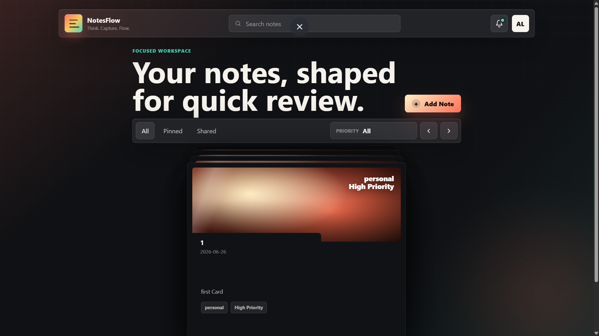
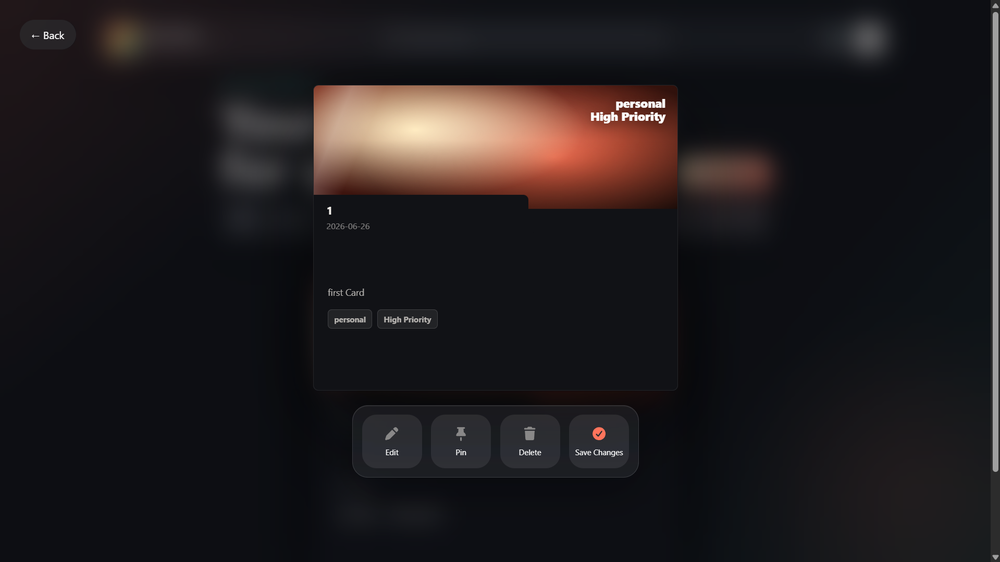

# 📝 NotesFlow

A modern glassmorphism-inspired note-taking application built with **HTML, CSS, and JavaScript**.

Users can create, manage, pin, browse, and view notes through an interactive stacked-card interface with smooth animations.

---

## ✨ Features

### 📌 Note Management
- Create notes
- Store notes in Local Storage
- View notes instantly
- Pin / Unpin notes
- Delete notes
- Edit existing notes *(in progress)*

### 🎴 Card Stack UI
- Beautiful stacked folder-card design
- Maximum 4 visible cards at a time
- Previous / Next card navigation
- Swipe support for mouse devices *(for touches in progress)*
- Smooth card transition animations

### 🎨 Modern Design
- Glassmorphism UI
- Responsive layout
- Animated modal windows
- Toast notifications
- Blur overlay viewer

### 💾 Persistence
- Notes are stored in browser Local Storage
- Data remains available after page refresh

---

## 📷 Screenshots

### Main Dashboard



### Card Viewer



---

## 🚀 Technologies Used

- HTML5
- CSS3
- JavaScript (Vanilla JS)
- Local Storage API

---

## 📂 Project Structure

```text
JsEventListner-Project04(NotesFlow)/
│
├── index.html
├── style.css
├── script.js
│
├── assets/
│   ├── dashboard.png
│   └── viewer.png
│
└── README.md
```

---

## ⚙️ Installation

Clone the repository:

```bash
git clone https://github.com/your-username/taskello-notes.git
```

Open the project folder:

```bash
cd JsEventListner-Project04
```

Run:

```bash
index.html
```

or use Live Server in VS Code.

---

## 🧠 How It Works

### Creating Notes

When a note is saved:

```javascript
notes.push(note);

localStorage.setItem(
  "notes",
  JSON.stringify(notes)
);
```

### Loading Notes

```javascript
let notes =
JSON.parse(localStorage.getItem("notes")) || [];
```

### Pinning Notes

Each note contains:

```javascript
{
    id: Date.now(),
    pin: false,
    title: "",
    category: "",
    priority: "",
    date: "",
    content: ""
}
```

Pinned state can be updated and stored back into Local Storage.

---

## 🎯 Future Improvements

- Search notes
- Category filters
- Drag & Drop sorting
- Dark / Light mode toggle
- Cloud synchronization
- Reminder
- Rich text editor
- Archive notes

---

## 🤝 Contributing

Contributions are welcome.

1. Fork the repository
2. Create a new branch

```bash
git checkout -b feature-name
```

3. Commit changes

```bash
git commit -m "Added feature"
```

4. Push

```bash
git push origin feature-name
```

5. Open a Pull Request

---

## 📄 License

This project is licensed under the MIT License.

---

## 👨‍💻 Author

**Satyam Raghuvanshi**

Built while learning modern frontend development and UI design.